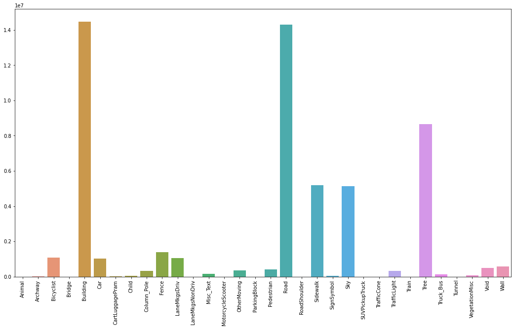
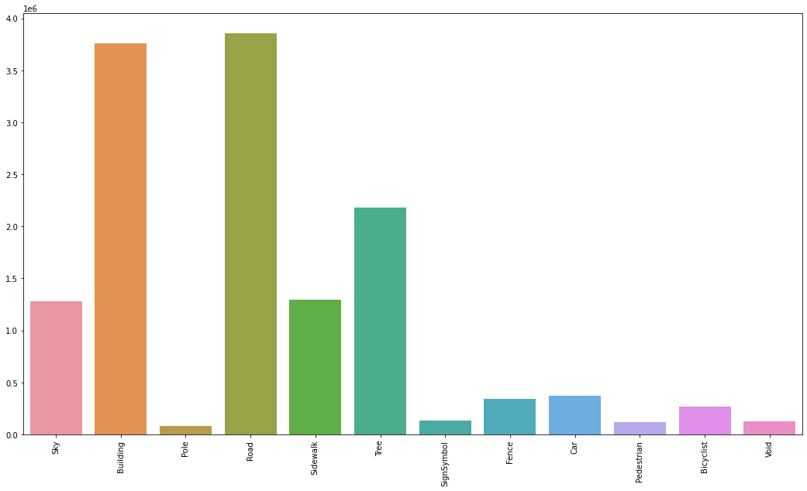
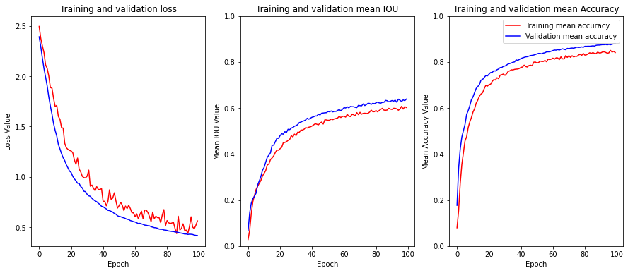
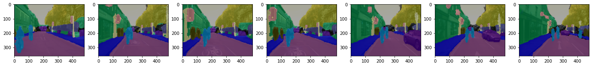

# buildings_and_road_segmentation
This repository fine tune SegFormer[2] (ViT model for semantic segmentation), on Camvid (CamSeq1) dataset.


# Dataset
The dataset used in this repository is **CamSeq01 Dataset**[1]. It is a video sequence of high resolution images, that is designed specifically for the problem of autonomous driving.
The sequence has been recorded in a moving vehicle in the city of Cambridge. You can find the link to the dataset [here](http://mi.eng.cam.ac.uk/research/projects/VideoRec/CamSeq01/CamSeq01.zip)

The dataset has **101** images with size **960x720** pixels. Each pixel has been manually labelled to one of **32 classes**.


In this repository, the classes has been grouped to 12 classes, see **data_handler/data.py**


# Download the dataset
Run the following command in the root of this repository

````bash
python ./utils/download_dataset.py --savedir="./dataset/camvid/"
````

# Repository structure

* **data_handler**: has all the functions necessary for visualizing and processing the dataset
* **model_builder**: Has necessary methods for creating and training the model
* **utils**: Has utility functions for downloading the dataset and plotting metrics during training.
* *camseq_semantic_segmentation.ipynb*: Notebook for training the model and evaluating the model.
* *requirements.txt*: has the required packages for the project to run in colab.

# Execution
This project was implemented using google colab. Thus it requires 1 GPU and 12GB memory.

To install the necessary packages, run :

````bash
pip install -r requirements.txt
````
# Training and Evaluation
The required time to train SegFormer-B2 was 10 hours.


Validation:


# Inference

# References
[1] Julien Fauqueur, Gabriel Brostow, Roberto Cipolla, Assisted Video Object Labeling By Joint Tracking of Regions and Keypoints, IEEE International Conference on Computer Vision (ICCV'2007) Interactive Computer Vision Workshop. Rio de Janeiro, Brazil, October 2007

[2] XIE, Enze, WANG, Wenhai, YU, Zhiding, et al. SegFormer: Simple and efficient design for semantic segmentation with transformers. Advances in Neural Information Processing Systems, 2021, vol. 34, p. 12077-12090.